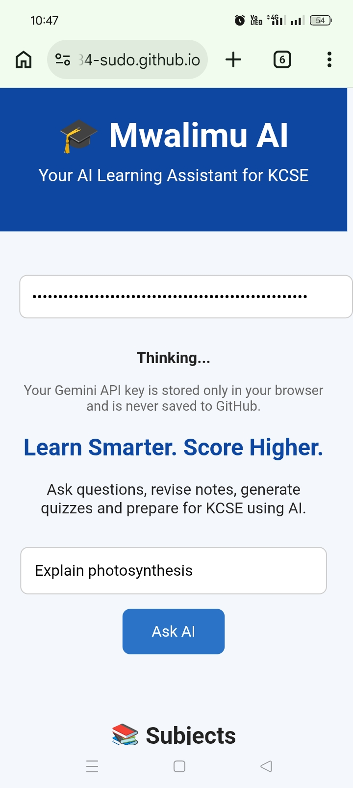
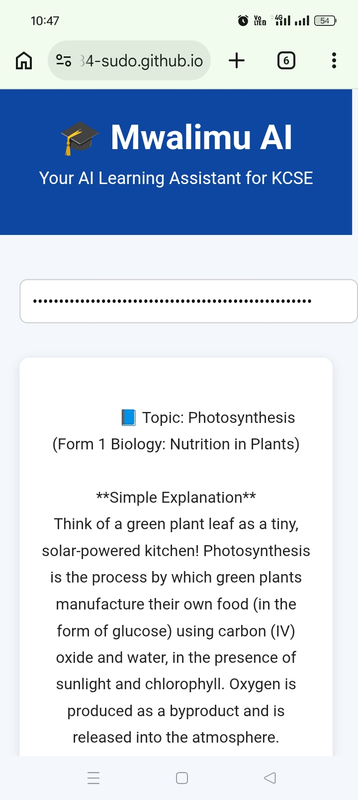

# Mwalimu AI

## Overview

Mwalimu AI is an AI-powered learning assistant designed to help Kenyan students prepare for the Kenya Certificate of Secondary Education (KCSE). The platform provides personalized academic support, explains difficult concepts, answers questions across subjects, and encourages independent learning through conversational AI.

🔗 **Live demo:** [carenchemutai384-sudo.github.io/Elimu---ai/](https://carenchemutai384-sudo.github.io/Elimu---ai/)

> The live demo requires your own free Gemini API key (get one at [aistudio.google.com](https://aistudio.google.com)). Your key is stored only in your browser and is never sent anywhere except Google's API — it is never saved to GitHub.

## Demo

*Asking a question and getting an instant, exam-formatted answer.*

| Homepage | Generated Answer |
|---|---|
| 

 | 

 |

## Features

- 🤖 AI-powered tutoring
- 📚 Support for KCSE subjects
- 💬 Interactive question-and-answer interface
- 📝 Clear explanations of complex topics
- 📱 Mobile-friendly design
- ⚡ Fast and easy-to-use interface

## Technologies Used

- HTML
- CSS
- JavaScript
- Google Gemini API (`gemini-flash-latest`)

## Getting Started

1. Clone this repository.
2. Open the project folder.
3. Get a free Gemini API key at [aistudio.google.com](https://aistudio.google.com).
4. Launch `index.html` in your browser and paste your API key into the field provided.

## Future Improvements

- User accounts and login
- Chat history
- Practice quizzes and mock exams
- Performance tracking
- Voice interaction
- Multi-language support

## Purpose

I've been tutoring my friends and juniors in Biology, Chemistry, and English for four years. My first AI project was an AI quiz generator I built to help students practice for exams. While testing it, I noticed something interesting: the wrong answer options the AI made up for Chemistry questions were way less convincing than the ones for Mathematics. That small thing made me think a lot about where AI can actually help students learn and where it still needs a human checking its work. Mwalimu AI is a new project built on that same idea — giving KCSE students real, exam-focused help across subjects, shaped by what I learned building the first one.

## A note on reliability

On Google's free API tier, the model occasionally returns a "high demand" error during peak usage. Waiting a few seconds and retrying usually resolves it — this is a rate limit on Google's end, not a bug in the app.

## License

This project is available for educational and personal use.

## Author

Developed by Abundance.
